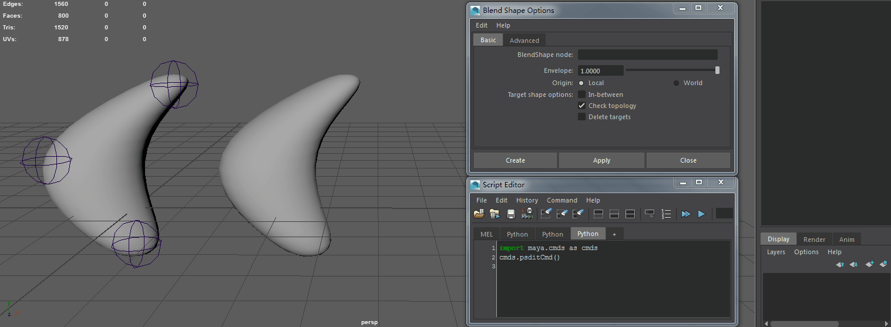

# maya-plugin-psdit

---


Maya plugin used to get an inverted shape.  

---

#### USAGE

1. Load plugins "psdit".
2. Pose your skinned model in the pose that you want to correct.
3. Duplicate the mesh and sculpt in your fixes. 
4. Select the original skinned model, shift select the corrected model and run:


    **run cmd without args :**

    ```python
    import maya.cmds as cmds    
    cmds.psditCmd()    
    ```
    
    
    
    **for some reason, you don't want to select the two models,  
    you can run cmd with args :**

    ```python
    import maya.cmds as cmds    
    cmds.psditCmd(b="base_model_name", 
                  c="corrective_model_name", 
                  n="invert_model_name",
                  d=False)    
    ```
    
    
    
    **you can type psditCmd cmd with -h flag to see the help info**  

    ```python
    cmds.psditCmd(h=True)

    psditCmd Help : 
        -b  -base   < string : base object name >
        -c  -corrective   < string : correctived object name >
        -n  -name   < string : inverter object name >
        -d  -deformer   < bool : if keep psditNode deformer > 
    ```


An inverted shape will be generated which you can then apply as a front of chain blendShape target.  
The generated shape will have a live deformer affecting it so edits you make on your corrected mesh  
will be inverted through the deformer.


#### SPEED TEST 

* 25000  Vertexes  :  0.16 second  

* 50000  Vertexes  :  0.26 second  

* 100000 Vertexes  :  0.48 second  
